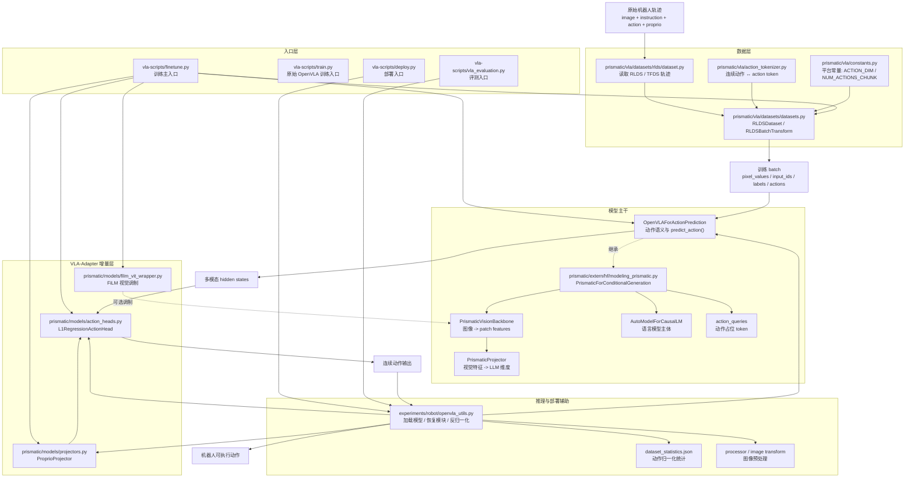

# VLA-Adapter 代码结构图

下面这张图把这个项目整理成一张“仓库分层 + 训练主链 + 推理闭环”的总图，适合你讲代码时先总览，再按主线展开。

## 读图说明

### 1. 最重要的一条训练主线

你讲代码时，最推荐按下面这条链路顺：

1. `vla-scripts/finetune.py`
2. `prismatic/vla/datasets/datasets.py` 里的 `RLDSBatchTransform`
3. `prismatic/extern/hf/modeling_prismatic.py` 里的 `PrismaticForConditionalGeneration.forward()`
4. `prismatic/extern/hf/modeling_prismatic.py` 里的 `OpenVLAForActionPrediction`
5. `prismatic/models/action_heads.py` 里的 `L1RegressionActionHead.predict_action()`

也就是：

`finetune() -> RLDSBatchTransform -> PrismaticForConditionalGeneration.forward() -> OpenVLAForActionPrediction -> L1RegressionActionHead.predict_action()`

### 2. 三层关系怎么理解

- `Prismatic`：多模态底座，负责图像和文本如何进入同一个模型。
- `OpenVLA`：建立在 `Prismatic` 上的机器人动作版本，增加动作 token、动作统计量和动作预测接口。
- `VLA-Adapter`：在 `OpenVLA` 之上新增的适配器层，重点是连续动作回归头、proprio projector、FiLM、多图像输入。

所以可以把整个项目压缩成一句话：

`Prismatic -> OpenVLA -> VLA-Adapter`

### 3. 为什么这张图里 action head 单独画一层

因为这篇工作最重要的变化，不只是让 VLM 输出离散动作 token，而是在 VLM 提供的多层 hidden states 之上，再加一个连续动作回归头。也就是说：

- VLM 主体负责多模态融合
- `OpenVLA` 负责动作语义占位与动作接口
- `L1RegressionActionHead` 负责最终连续动作回归

### 4. 推理闭环怎么收

推理和部署时，`openvla_utils.py` 会把下面这些东西重新拼起来：

- `OpenVLAForActionPrediction`
- `L1RegressionActionHead`
- `ProprioProjector`
- `dataset_statistics.json`
- `processor / image transform`

最后输出的不是归一化动作，而是经过统计量反归一化后的机器人可执行动作。

